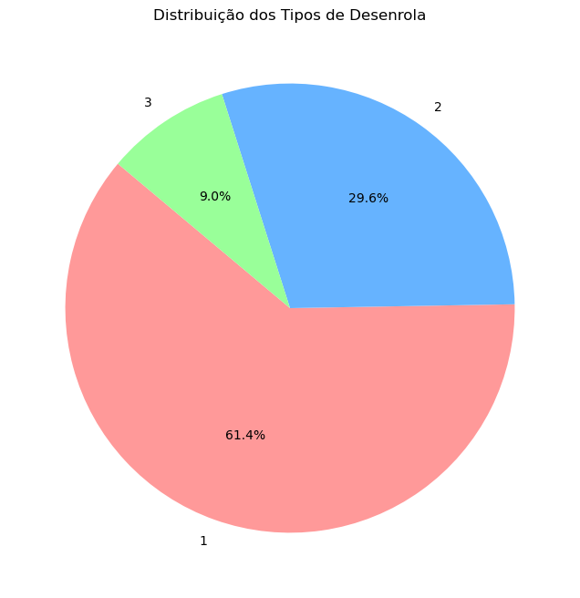
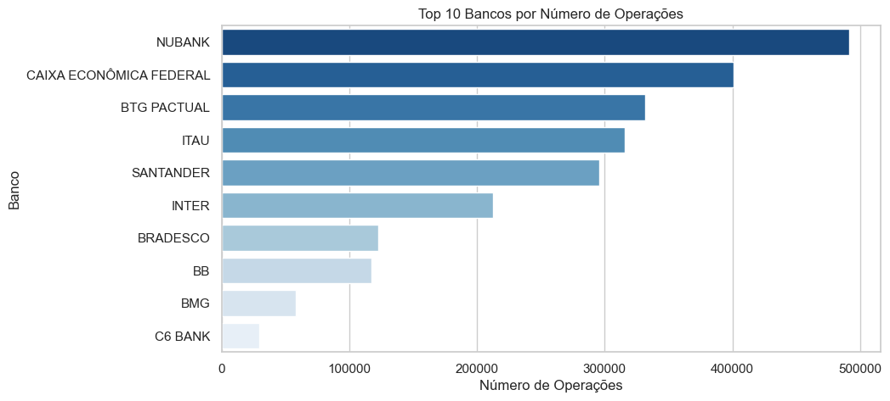
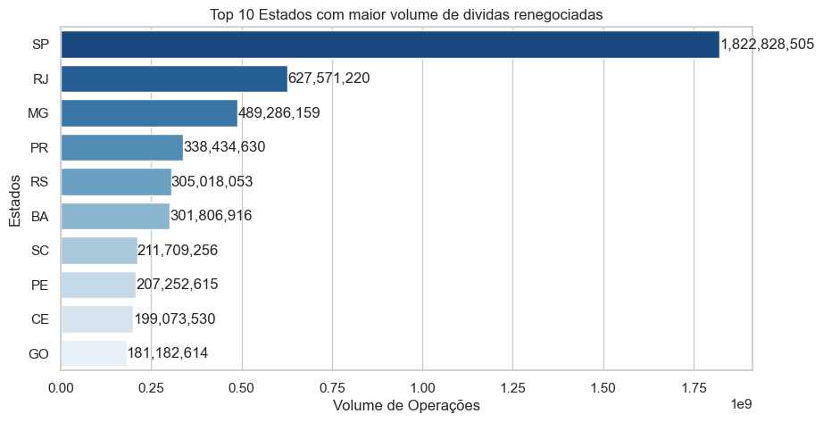

# 📊 **Análise do Programa Desenrola Brasil: Impacto e Tendências nas Renegociações de Dívidas**  

---

## 🔍 **Sobre o Programa Desenrola Brasil**  
O **Desenrola Brasil** é um programa do Governo Federal criado em **2023** para ajudar pessoas físicas e pequenos negócios a renegociar dívidas em condições mais justas.  

---

### 🎯 **Objetivos Principais**  
1. **Reduzir a inadimplência**: Facilitar o pagamento de dívidas para milhões de brasileiros.  
2. **Oferecer condições acessíveis**: Descontos, prazos estendidos e taxas de juros reduzidas.  
3. **Estimular a economia**: Aumentar o poder de compra e reaquecer o crédito no país.  

---

### 👥 **Para Quem é o Programa?**  
- **Faixa 1**: Pessoas físicas com renda mensal de até **R$ 20 mil** ([Lei nº 14.690/2023](https://www.planalto.gov.br/ccivil_03/_ato2023-2026/2023/lei/l14690.htm)).  
- **Faixa 2**: Pessoas físicas com renda mensal de **R$ 20 mil a R$ 40 mil** ([Lei nº 14.690/2023](https://www.planalto.gov.br/ccivil_03/_ato2023-2026/2023/lei/l14690.htm)).  
- **Faixa 3**: Pequenos negócios ([MP nº 1.213/2024](https://www.planalto.gov.br/ccivil_03/_ato2023-2026/2024/mpv/mp1213.htm)).  

---

### ⚙️ **Como Funciona?**  
- **Renegociação de dívidas**: Bancos e instituições financeiras oferecem condições especiais para quitar débitos.  
- **Descontos no valor total**: Em alguns casos, o valor da dívida pode ser reduzido significativamente.  
- **Adesão voluntária**: Credores precisam participar do programa para ofertar as condições.  

---

## 🚀 **Por Que Analisar Esses Dados?**  
Este projeto explora dados oficiais do **Banco Central do Brasil** para entender:  
- ✅ **Qual a faixa que está tendo mais adesão ao programa no período analisado?**  
- ✅ **Quais bancos estão mais ativos no período analisado?**  
- ✅ **Qual o estado com maior volume de operações no período analisado?**  

### 🌟 **Impacto Prático**  
Os resultados podem ajudar:  
- **Governo**: Ajustar políticas públicas.  
- **Bancos**: Identificar oportunidades de mercado.  
- **Cidadãos**: Entender tendências de renegociação.  

---

📊 **Base de Dados Usada**  
Dados mensais das operações de crédito renegociadas no âmbito do Desenrola Brasil, disponíveis no [Portal de Dados Abertos do BCB](https://dadosabertos.bcb.gov.br/dataset/desenrola-brasil).  

---

✨ **Contextualização é poder!**  
Mesmo sem conhecer o programa, essa análise revela como políticas públicas podem transformar realidades econômicas.

